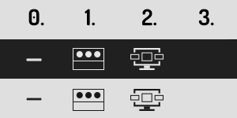

[](#install)
[](https://github.com/relikd/Memmon/releases)
[](https://github.com/relikd/Memmon/releases)


# Memmon

Memmon remembers what your Mac forgets – A simple deamon that restores your window positions on external monitors.

**Limitations:**
- Currently, Memmon restores windows in other spaces only if the space is activated.
  If you know a way to access the accessibility settings of a different space, let me know.
- Support for the Misson Control config option “Displays have separate Spaces” is not tested.
  I will add support for this as soon as I have access to an external monitor again (issue [#5](https://github.com/relikd/Memmon/issues/5#issuecomment-1040611494)).


## Install

1. You will need macOS 10.10 or newer.
   Download and unzip the tar.gz from [latest release](https://github.com/relikd/Memmon/releases/latest).
2. Grant Memmon the Accessibility privilege.
   Go to "System Preference" > "Security & Privacy" > "Accessibility" and add Memmon to that list.
   (Otherwise, the app has no purpose as it can't move application windows around.)
3. Thats it. The app runs in your menu bar.

Alternatively, you can compile Memmon from source by running `make`, or call the script directly (`swift src/main.swift`) without building an app bundle.


### Menu Bar Icon

You can hide the menu bar icon either via `defaults` or the same-titled menu entry.
If you do so, the only way to quit the app is by killing the process (with Activity.app or `killall Memmon`).
The menu bar icon stays hidden during this execution only. If you restart the OS or app it will reappear (unless you hide the icon with `defaults`).

Memmon has exactly one app-setting, the menu bar icon.
You can manipulate the display of the icon, or hide the icon completely:

```sh
# disable menu bar icon completely
defaults write de.relikd.Memmon icon -int 0
# Use window-dots-icon
defaults write de.relikd.Memmon icon -int 1
# Use monitor-with-windows icon (default)
defaults write de.relikd.Memmon icon -int 2
# re-enable menu bar icon and use default icon
defaults delete de.relikd.Memmon icon
```




## FAQ

### Why‽

I am frustrated!
Why does my Mac forget all window positions which I moved to a second screen?
Every time I unplug the monitor.
Every time I close my Macbook lid.
Every time I lock my Mac.

Is it macOS 11?
Is it the USB-C-to-HDMI converter dongle (notably one made by Apple)?
Why do I have to fix things that Apple should have fixed long ago? …


### Aren't there other solutions?

Yes, for example, you can use [Mjolnir](https://github.com/mjolnirapp/mjolnir) or [Hammerspoon](https://github.com/Hammerspoon/hammerspoon) (and some comercial ones) to restore your perfect window setup on a button press.
But I do not need a full-fledged window manager or the dependencies it relies on.
Nor do I want to constantly adjust for new windows.
Actually, I don't want to think about this problem at all – I just want to fix this damn bug.


### What is it good for?

First off, Memmon is less than 300 lines of code – no dependencies.
You can audit it in 10 minutes...
And build it from scratch – just run `make`.

Secondly, it does one thing and one thing only:
Save and restore window positions whenever your monitor setup changes.


### Develop

You can either run the `main.swift` file directly with `swift main.swift`, via Terminal `./main.swift` (`chmod 755 main.swift`), or create a new Xcode project.
In Xcode, select the Command-Line template and replace the template provided `main.swift` with this one.
